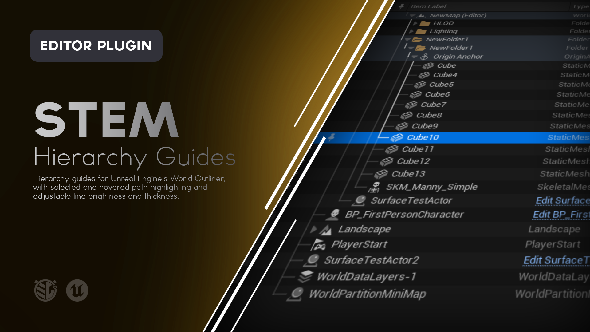
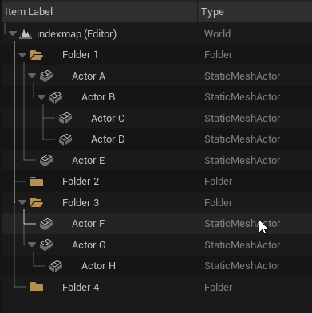
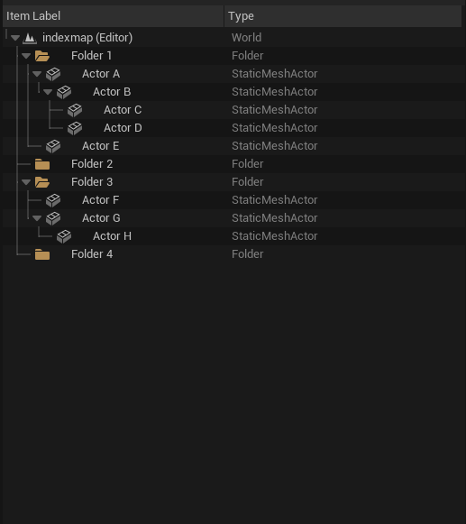
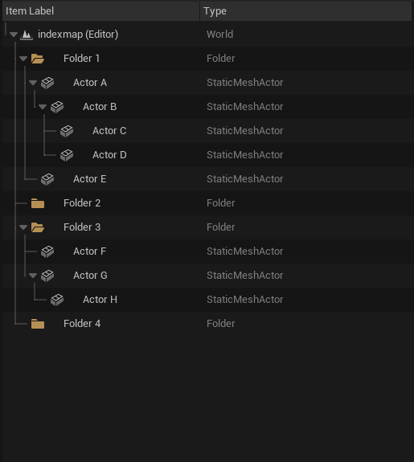
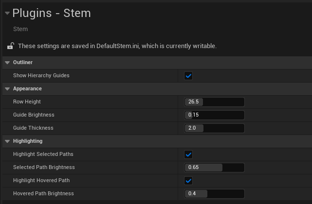

# Stem

**Clearer hierarchy guides and adjustable spacing for Unreal Engine's World Outliner.**

Stem improves World Outliner readability with visual hierarchy guides, selected and hovered path highlighting, and configurable row height.

Make dense Actor and Folder hierarchies easier to trace without changing the structure of your level.




---

## What is Stem?

Large World Outliner hierarchies can become difficult to read once Actors, Folders, and attached hierarchies begin nesting several levels deep.

At a glance, it can be difficult to tell:

- Which parent a row belongs to
- How far a hierarchy extends
- Which branch a selected Actor belongs to
- Where several selected Actors share the same hierarchy
- Which path connects a deeply nested Actor back to its ancestors

Stem adds visual hierarchy guides directly beside Unreal Engine's existing expansion controls.

The guides clarify how rows are connected without replacing the normal World Outliner workflow.

Select an Actor and Stem can brighten its path back through the hierarchy.

Hover over another row and Stem can temporarily highlight that path without changing your selection.

You can also adjust World Outliner row height, guide brightness, guide thickness, and highlight intensity to fit your workspace.

---

# Features

### Hierarchy Guides

Adds visual connector lines between parent and child rows in the World Outliner.

### Folder and Actor Hierarchies

Guides work across displayed Folder structures and attached Actor hierarchies.

### Selected Path Highlighting

Select a row to brighten the hierarchy path connecting it to its visible ancestors.

### Multiple Selection Highlighting

Select several rows and Stem displays their combined hierarchy paths.

Shared path segments retain a consistent brightness instead of becoming brighter each time another selected Actor shares them.

### Hovered Path Highlighting

Hover over a row to temporarily highlight its hierarchy path without changing the current selection.

### Combined Selection and Hover

Selection and hover highlighting can be active at the same time.

Where the two paths overlap, Stem uses the brighter configured value.

### Adjustable Row Height

Increase World Outliner row spacing to make dense hierarchies easier to scan.

Stem never reduces rows below Unreal Engine's native minimum height.

### Adjustable Guide Brightness

Control how subtle or prominent the normal hierarchy guides appear.

### Adjustable Guide Thickness

Control the width of hierarchy guide lines.

### Adjustable Highlight Brightness

Configure selected and hovered hierarchy paths independently.

### Native Expansion Controls

Stem preserves Unreal Engine's normal expansion arrows and expansion behavior.

### Clean Expansion Arrow Rendering

Guide lines leave space around expansion triangles so the lines do not visually cut through the controls.

### Per-Outliner Interaction

Each World Outliner maintains its own hover and selection presentation.

### Editor Only

Stem changes editor presentation only.

It does not modify Actors, Folders, attachments, level hierarchy, or runtime gameplay.

---

> [!IMPORTANT]
> **ATTENTION - README AUTHOR**
>
> This should be the main demonstration of Stem.
>
> **Recommended visual:** GIF
>
> Use a reasonably deep expanded hierarchy and show:
>
> 1. No Actor selected.
> 2. Select a deeply nested Actor.
> 3. Show its path brighten back toward its visible ancestors.
> 4. Ctrl-select another Actor from a different branch.
> 5. Show both paths highlighted.
> 6. Hover another row.
> 7. Move the cursor away and show the hover highlight disappear.
>
> Keep the World Outliner stationary during the recording.
>
> The hierarchy should be complicated enough that the usefulness of the path highlighting is immediately obvious.
>
> Around 8 to 12 seconds is ideal.
>
> **Suggested file:**
>
> `Doc/Images/Stem-Path-Highlighting.gif`
>
> Once captured, replace this callout with:
>
> ```markdown
> 
> ```

---

# Using Stem

Stem integrates directly into the standard World Outliner.

There is no separate Stem window and no additional visible Outliner column.

Once enabled, hierarchy guides appear automatically beside compatible expanded hierarchy rows.

Use the World Outliner normally.

---

## Hierarchy Guides

Stem draws neutral hierarchy lines that visually connect parent and child rows.

For example:

```text
Environment
├── Building
│   ├── Exterior
│   │   ├── Wall_A
│   │   └── Wall_B
│   └── Interior
│       ├── Furniture
│       └── Lighting
└── Landscape
```

The guides make it easier to visually follow each branch through a dense hierarchy.

Collapsed branches are represented normally.

Stem only draws the hierarchy currently displayed by the World Outliner.

---

# Selected Path Highlighting

Select an Actor or Folder and Stem brightens the visible hierarchy path connecting that row to its ancestors.

For example:

```text
Environment
└── Building
    └── Interior
        └── Furniture
            └── Chair
```

Selecting `Chair` highlights the connector path running through:

```text
Chair
Furniture
Interior
Building
Environment
```

This makes deeply nested selections much easier to locate within a large Outliner.

---

# Multiple Selection

Stem also supports multiple selected rows.

For example:

```text
Environment
├── Building
│   ├── Interior
│   │   └── Chair
│   └── Exterior
│       └── Door
└── Landscape
```

Selecting both `Chair` and `Door` highlights both hierarchy paths.

The shared portion through `Building` and `Environment` remains at the configured selected-path brightness.

It does not become brighter simply because multiple selected paths overlap.

---

# Hover Highlighting

Hover over a World Outliner row and Stem temporarily brightens that row's visible ancestor path.

This does not change the current selection.

Move the cursor away and the hover highlight disappears.

Hover highlighting is useful when scanning a dense hierarchy because you can quickly trace relationships without repeatedly selecting Actors.

---

# Selection and Hover Together

Selected and hovered path highlighting operate independently.

You can have one hierarchy highlighted because it is selected while temporarily inspecting another by hovering over it.

If the selected and hovered paths overlap, Stem uses whichever configured brightness is stronger.

The highlights do not stack together and exceed the intended brightness.

---

# Expanding and Collapsing Hierarchies

Stem preserves Unreal Engine's normal World Outliner expansion behavior.

You can:

- Expand rows normally
- Collapse rows normally
- Use Unreal Engine's existing modifier-based expansion behavior
- Continue using the normal expansion triangles

Stem leaves a small visual gap around the expansion triangle so hierarchy lines remain readable without drawing through the icon.

---

# Row Height

Stem can adjust the vertical spacing of World Outliner rows.

Open:

**Project Settings > Plugins > Stem**

and change:

**Row Height**

The default is:

```text
26.5
```

Increasing this value creates additional vertical breathing room between rows.

This can make large hierarchies easier to scan and can provide more separation between:

- Labels
- Icons
- Expansion controls
- Hierarchy guides

Changes apply immediately to open standard World Outliners.

Stem will not shrink rows below Unreal Engine's native minimum row height.

> [!IMPORTANT]
> **ATTENTION - README AUTHOR**
>
> Capture a row-height comparison here.
>
> **Recommended visual:** Side-by-side screenshot
>
> Use the same hierarchy twice.
>
> **Left:** Default Stem row height of `26.5`.
>
> **Right:** A noticeably larger value, such as `36`.
>
> Do not exaggerate it to the point where the second image looks impractical. The goal is to show that spacing can be tuned for readability.
>
> **Suggested files:**
>
> - `Doc/Images/Stem-Row-Height-Default.png`
> - `Doc/Images/Stem-Row-Height-Large.png`
>
> Once captured, replace this callout with:
>
> ```markdown
> | Default Row Height | Increased Row Height |
> |---|---|
> |  |  |
> ```

---

# Project Settings

Open:

**Project Settings > Plugins > Stem**

to configure Stem.

| Setting | Default | Description |
|---|---:|---|
| **Show Hierarchy Guides** | On | Shows or hides Stem's hierarchy guides. |
| **Row Height** | 26.5 | Controls World Outliner row height in pixels. |
| **Guide Brightness** | 0.15 | Controls the brightness of normal hierarchy guides. |
| **Guide Thickness** | 2.0 | Controls the width of hierarchy guide lines. |
| **Highlight Selected Paths** | On | Enables hierarchy highlighting for selected rows. |
| **Selected Path Brightness** | 0.65 | Controls the brightness of selected hierarchy paths. |
| **Highlight Hovered Path** | On | Enables temporary hierarchy highlighting when hovering a row. |
| **Hovered Path Brightness** | 0.40 | Controls the brightness of hovered hierarchy paths. |

---

## Show Hierarchy Guides

Disable this setting to hide Stem's hierarchy connector lines.

This can be useful if you want to temporarily return to Unreal Engine's normal visual presentation without disabling the plugin.

---

## Guide Brightness

Controls the opacity of the normal hierarchy guides.

Valid range:

```text
0.0 to 1.0
```

Lower values create subtle hierarchy lines.

Higher values make the hierarchy increasingly prominent.

Default:

```text
0.15
```

---

## Guide Thickness

Controls the stroke width of Stem's hierarchy lines.

Valid range:

```text
1.0 to 4.0
```

Default:

```text
2.0
```

The rendered thickness scales with Unreal Editor's UI scaling.

---

## Selected Path Brightness

Controls the brightness of hierarchy paths belonging to selected rows.

Default:

```text
0.65
```

The selected highlight will never make a guide darker than its normal guide brightness.

---

## Hovered Path Brightness

Controls the brightness of the hierarchy path beneath the mouse cursor.

Default:

```text
0.40
```

Because selected and hovered brightness are configured independently, selection can remain more prominent than temporary hover feedback.

---

> [!IMPORTANT]
> **ATTENTION - README AUTHOR**
>
> Capture the Stem Project Settings here.
>
> **Recommended visual:** Screenshot
>
> Show:
>
> **Project Settings > Plugins > Stem**
>
> Make sure all settings are visible:
>
> - Show Hierarchy Guides
> - Row Height
> - Guide Brightness
> - Guide Thickness
> - Highlight Selected Paths
> - Selected Path Brightness
> - Highlight Hovered Path
> - Hovered Path Brightness
>
> **Suggested file:**
>
> `Doc/Images/Stem-Settings.png`
>
> Once captured, replace this callout with:
>
> ```markdown
> 
> ```

---

# Example Workflow

Imagine a level with a large environment hierarchy:

```text
Environment
├── Exterior
│   ├── Buildings
│   │   ├── Building_A
│   │   ├── Building_B
│   │   └── Building_C
│   ├── Streets
│   └── Props
├── Interior
│   ├── Rooms
│   │   ├── Lobby
│   │   ├── Office
│   │   └── Storage
│   ├── Furniture
│   └── Lighting
└── Gameplay
    ├── Encounters
    ├── Pickups
    └── Triggers
```

Without hierarchy guides, tracing a row several indentation levels back to its parent can require carefully following spacing and expansion controls.

With Stem:

1. The hierarchy guides make the structure visible at a glance.
2. Select `Office` and its path through `Rooms`, `Interior`, and `Environment` becomes more prominent.
3. Hover `Building_B` to inspect its hierarchy without changing your current selection.
4. Increase Row Height if the hierarchy feels visually cramped.
5. Tune guide and highlight brightness until they fit your preferred workspace.

Stem does not change the hierarchy.

It makes the hierarchy easier to read.

---

# Saving Stem Settings

Stem settings are stored in project configuration.

This means your configured:

- Row height
- Guide visibility
- Guide brightness
- Guide thickness
- Selected path settings
- Hovered path settings

can persist with the project rather than needing to be configured each time the editor opens.

Stem does not store anything on individual Actors, Folders, or levels.

Changing Stem settings does not dirty your level.

---

# Installation

Stem can be installed through **Fab**, from a **precompiled GitHub Release**, or directly from the **GitHub source**.

For most users, the Fab or GitHub Release installation is recommended.

---

## Fab / Epic Games Launcher

> **Availability:** Use this installation method once Stem is available through Fab.

1. Add **Stem** to your library on Fab.
2. Open the **Epic Games Launcher**.
3. Navigate to your Unreal Engine Library.
4. Locate Stem in your Fab / Vault library.
5. Install Stem to the supported Unreal Engine version.
6. Launch your Unreal Engine project.
7. Open **Edit > Plugins**.
8. Search for **Stem**.
9. Enable the plugin if it is not already enabled.
10. Restart Unreal Editor if prompted.

Once enabled, Stem's hierarchy guides will appear in the standard World Outliner.

---

## GitHub Release

> [!NOTE]
> Precompiled GitHub packages will appear on the repository's **Releases** page when available.

### 1. Download Stem

Open the repository's **Releases** page:

```text
https://github.com/mippi-the-dork/Stem/releases
```

Download the packaged plugin matching your Unreal Engine version and platform.

For example:

```text
Stem-v1.0.2-UE5.8.2-Win64.zip
```

Do not use GitHub's automatically generated **Source code** ZIP as a precompiled plugin package.

### 2. Close Unreal Editor

Close the project before installing the plugin.

### 3. Locate Your Project Plugins Folder

Your project should contain a `Plugins` directory beside the `.uproject` file:

```text
YourProject/
├── Config/
├── Content/
├── Plugins/
└── YourProject.uproject
```

If the `Plugins` directory does not exist, create it.

### 4. Extract Stem

Extract the `Stem` folder into:

```text
YourProject/Plugins/
```

The final structure should look similar to:

```text
YourProject/
├── Plugins/
│   └── Stem/
│       ├── Config/
│       ├── Doc/
│       ├── Resources/
│       ├── Source/
│       └── Stem.uplugin
└── YourProject.uproject
```

### 5. Launch the Project

Open your Unreal Engine project.

If necessary, navigate to:

**Edit > Plugins**

Search for:

```text
Stem
```

Enable the plugin and restart Unreal Editor if prompted.

---

## GitHub Source

Developers who want the source or want to modify Stem can clone the repository directly.

### Requirements

Building Stem from source requires a working Unreal Engine C++ development environment.

For Windows this generally means:

- Unreal Engine 5.8.x
- Visual Studio with the appropriate C++ workloads
- A project capable of compiling C++ plugins

### Clone the Repository

Close Unreal Editor and navigate to your project's `Plugins` directory.

```bash
cd YourProject/Plugins
git clone https://github.com/mippi-the-dork/Stem.git
```

Your project should now contain:

```text
YourProject/Plugins/Stem/
```

### Generate Project Files

If necessary:

1. Right-click your `.uproject`.
2. Select **Generate Visual Studio project files**.

Then open the generated solution and build your project's Editor target.

For example:

```text
YourProjectEditor
Win64
Development Editor
```

Launch the project after compilation completes.

---

# Updating Stem

## GitHub Release Installation

When updating a manually installed release:

1. Close Unreal Editor.
2. Remove the existing `Plugins/Stem` folder.
3. Extract the new Stem release into the `Plugins` directory.
4. Reopen the project.

Replacing the complete plugin folder is recommended rather than copying individual files over an older version.

Project-level Stem settings are stored outside the plugin folder and should remain intact.

---

## Git Source Installation

If you cloned the repository using Git:

```bash
cd YourProject/Plugins/Stem
git pull
```

Rebuild the project if the source has changed.

---

# Compatibility

The current Stem version targets:

| | |
|---|---|
| **Stem Version** | 1.0.2 |
| **Unreal Engine** | 5.8.x |
| **Tested Version** | 5.8.2 |
| **Platform** | Windows 64-bit |
| **Plugin Type** | Editor |
| **Runtime Dependency** | None |
| **Runtime Actors** | None |
| **Runtime Components** | None |
| **Packaged Game Impact** | None |

Stem's plugin descriptor targets Unreal Engine 5.8.0, with the current version manually tested in Unreal Engine 5.8.2.

Compatibility with additional Unreal Engine versions or platforms should not be assumed unless explicitly listed in a release.

---

# How Stem Works

Stem extends the standard World Outliner's existing hierarchy presentation rather than creating a separate hierarchy system.

For each supported World Outliner:

1. Stem preserves Unreal Engine's normal Item Label content.
2. It retains Unreal's normal expansion behavior.
3. It adds hierarchy guide rendering around the existing expansion controls.
4. It reads the displayed parent and child relationships.
5. It determines the visible path between selected or hovered rows and their ancestors.
6. It brightens the relevant guide segments according to the configured settings.
7. A hidden layout element contributes the configured row height without adding a visible column.

Stem samples displayed hierarchy paths at a limited frequency rather than searching every Actor in the world every frame.

The hierarchy itself remains owned entirely by Unreal Engine.

---

# What Stem Does Not Do

Stem is an **editor readability tool**.

It does not:

- Modify Actor attachments
- Move Actors between Folders
- Create Actors
- Add Components
- Rename Actors
- Rename Folders
- Change hierarchy structure
- Modify saved levels
- Add runtime systems
- Affect packaged gameplay
- Replace the World Outliner
- Add a visible Outliner column
- Change the meaning of Unreal Engine's hierarchy

Stem improves how the existing hierarchy is displayed.

It does not change what that hierarchy contains.

---

# Limitations

### Displayed Hierarchy

Stem draws guides for the hierarchy currently displayed in the World Outliner.

Collapsed or filtered-out hierarchy portions are not drawn until they become visible.

### Custom Outliners

Stem targets the standard World Outliner.

Specialized custom Outliner implementations or custom expansion widgets are outside its intended integration.

### Pinned Ancestors

Pinned ancestor duplicates retain Unreal Engine's native presentation and are not treated as normal hover targets by Stem.

### Existing Outliner Tabs

After initially enabling Stem, an already open World Outliner may occasionally need to be reopened or the editor restarted before all presentation changes appear.

### Editor Only

Stem contains no runtime module.

Its visual changes exist only inside Unreal Editor.

---

# Troubleshooting

## Stem Does Not Appear in the World Outliner

Check:

**Edit > Plugins**

Search for:

```text
Stem
```

Confirm that the plugin is enabled.

Restart Unreal Editor if the plugin was just enabled.

If an existing World Outliner was already open when Stem became active, close and reopen that Outliner tab.

---

## Hierarchy Guides Are Missing

Open:

**Project Settings > Plugins > Stem**

Make sure:

**Show Hierarchy Guides**

is enabled.

Also make sure the hierarchy is expanded.

Stem does not draw hidden portions of collapsed branches.

---

## Selected Paths Do Not Highlight

Check:

**Project Settings > Plugins > Stem**

and confirm:

**Highlight Selected Paths**

is enabled.

Also make sure **Selected Path Brightness** is noticeably higher than **Guide Brightness**.

---

## Hover Highlighting Does Not Appear

Confirm:

**Highlight Hovered Path**

is enabled.

Try increasing:

**Hovered Path Brightness**

if the difference from the normal guide brightness is too subtle.

---

## The Guides Are Too Bright

Reduce:

**Guide Brightness**

under:

**Project Settings > Plugins > Stem**

The default is intentionally subtle at:

```text
0.15
```

---

## The Guides Are Too Thick

Reduce:

**Guide Thickness**

The supported range is:

```text
1.0 to 4.0
```

with a default of:

```text
2.0
```

---

## Changing Row Height Does Not Make Rows Smaller

Stem will not reduce World Outliner rows below Unreal Engine's native minimum row height.

Values beneath that minimum therefore produce no additional reduction.

---

## A Filter Changed Which Guides I Can See

Stem follows the hierarchy currently displayed by the World Outliner.

Rows hidden by the active filter are not drawn until they are visible again.

The underlying Actor or Folder hierarchy has not been changed.

---

# Reporting Bugs

If you encounter a problem, please open an issue:

```text
https://github.com/mippi-the-dork/Stem/issues
```

When reporting a bug, include:

- Stem version
- Unreal Engine version
- Windows version
- Whether Stem was installed from Fab, a GitHub Release, or source
- Whether the issue affects guides, selection highlighting, hover highlighting, or row height
- A description of the hierarchy involved
- Steps to reproduce the problem
- Screenshots or video when relevant
- Any relevant Unreal Editor log output

For visual issues, a screenshot of the affected World Outliner is especially helpful.

---

# Feature Requests

Suggestions and feature requests are welcome through GitHub Issues.

When proposing a feature, describe the readability or hierarchy-navigation problem you're trying to solve rather than only the implementation you would like to see.

That makes it easier to determine whether the feature belongs in Stem and whether there may be a simpler solution.

---

# Contributions

Pull requests are welcome.

If you're considering a significant change, opening an Issue first is recommended so the intended behavior can be discussed before substantial work is done.

Stem is intended to remain focused on World Outliner readability and hierarchy presentation.

---

# License

Stem is distributed under the **MIT License**.

See [`LICENSE`](LICENSE) for details.

---

# About

Stem is an Unreal Engine editor utility created by **Mippi the Dork**.

The plugin was built around a simple idea:

> A hierarchy should be easy to follow, no matter how deep it grows.

Stem makes the World Outliner's existing structure easier to read without changing the structure itself.
